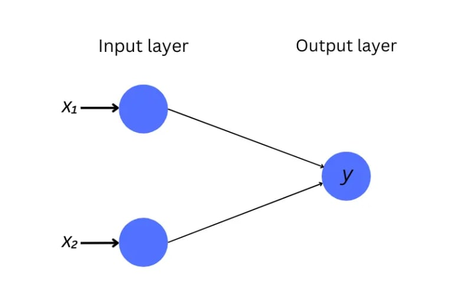

# neural-network

Implemented in Java based on [Building a Neural Network in Rust (From Scratch) ](https://dev.to/farshed/building-a-neural-network-in-rust-from-scratch-5bm1)

Adding one hidden layer

Adding another hidden layer

How about such a configuration?

